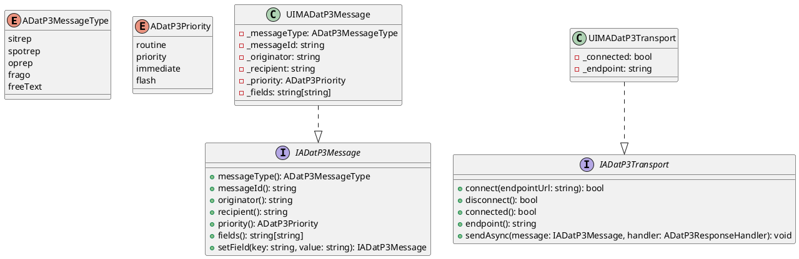
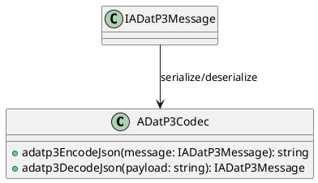
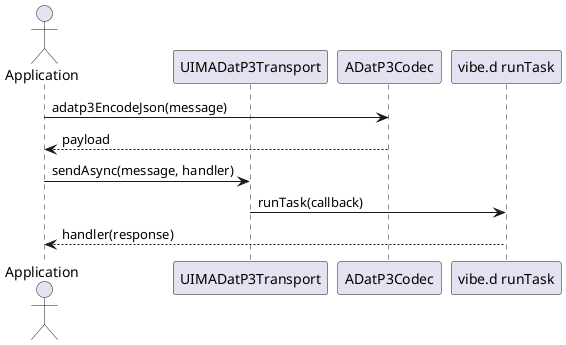

/****************************************************************************************************************
* Copyright: © 2018-2026 Ozan Nurettin Süel (aka UI-Manufaktur UG *R.I.P*)
* License: Subject to the terms of the Apache 2.0 license, as written in the included LICENSE.txt file.
* Authors: Ozan Nurettin Süel (aka UI-Manufaktur UG *R.I.P*)
*****************************************************************************************************************/

# UIM-ADatP3 UML Description

## Overview
The UIM-ADatP3 library models NATO ADatP-3 messages in D and provides a codec and async transport facade. The transport uses vibe.d task scheduling to dispatch responses without blocking caller code.

## Core Types

## Codec Layer

## Sequence

