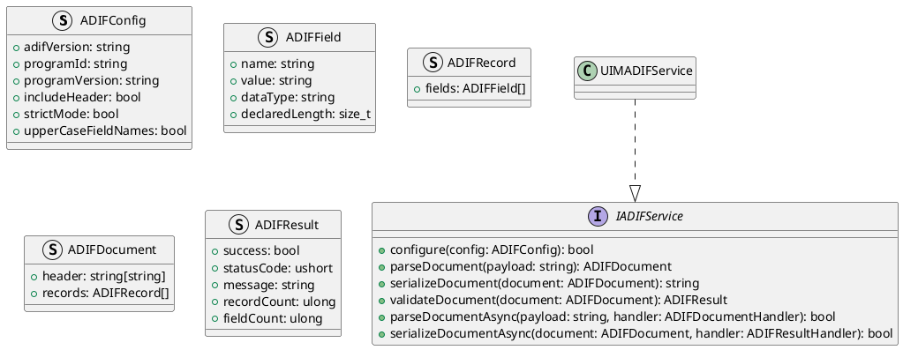
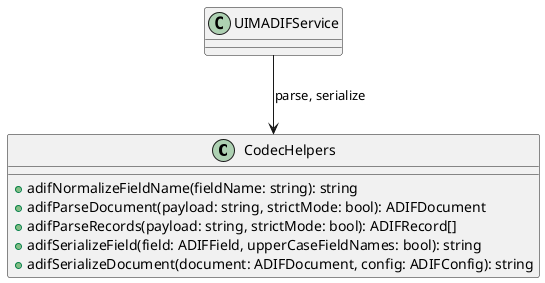
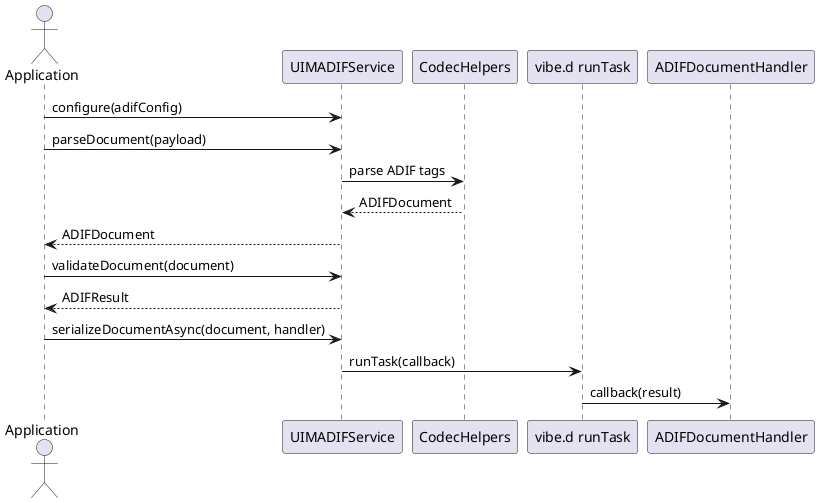

# UIM-ADIF UML Description

## Overview

The UIM-ADIF library provides a compact architecture for ADIF logbook exchange workflows in D. It combines typed contracts, parser/serializer helpers, result model constructors, and asynchronous orchestration with vibe.d.

## Core Types

## Helper Layer

## Sequence

