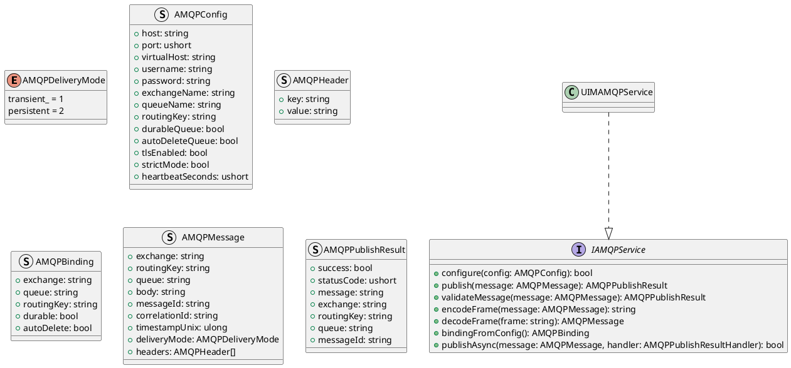
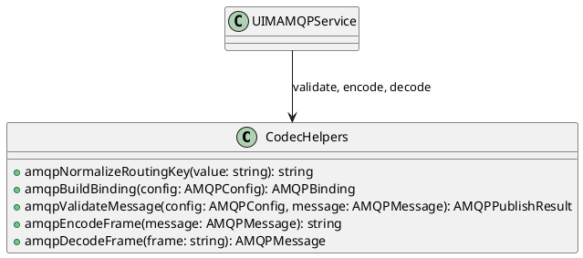
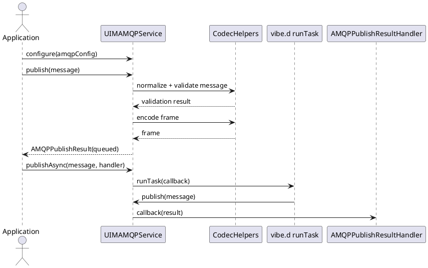

# UIM-AMQP UML Description

## Overview

The UIM-AMQP library provides a compact architecture for AMQP messaging workflows in D. It combines typed contracts, message and binding models, routing/codec helpers, and asynchronous orchestration with vibe.d.

## Core Types

## Helper Layer

## Sequence

