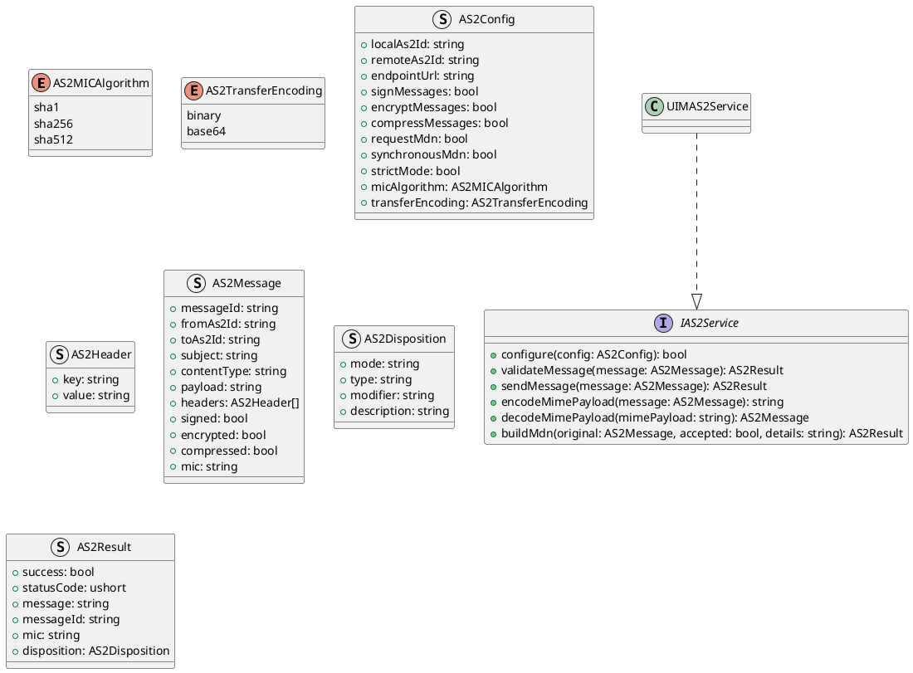
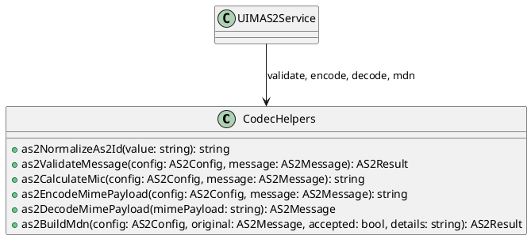
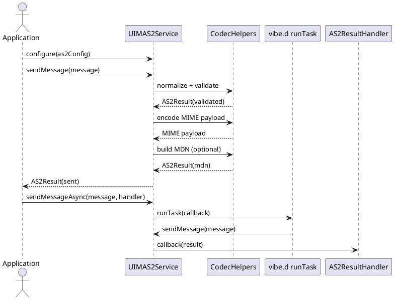

# UIM-AS2 UML Description

## Overview

The UIM-AS2 library provides a compact architecture for AS2 message exchange workflows in D. It combines typed contracts, MIME/MDN helper functions, and asynchronous orchestration with vibe.d.

## Core Types

## Helper Layer

## Sequence

