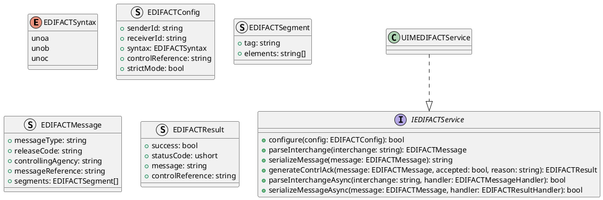
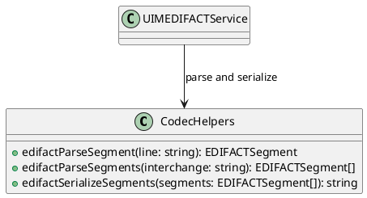
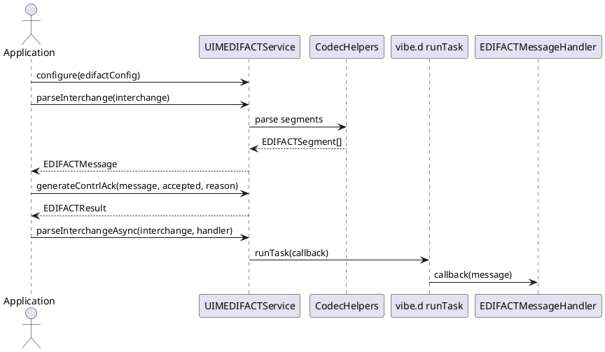

# UIM-EDIFACT UML Description

## Overview

The UIM-EDIFACT library provides a compact architecture for EDIFACT interchange workflows in D. It combines typed contracts, parser/serializer helpers, result model constructors, and asynchronous orchestration with vibe.d.

## Core Types

## Helper Layer

## Sequence

