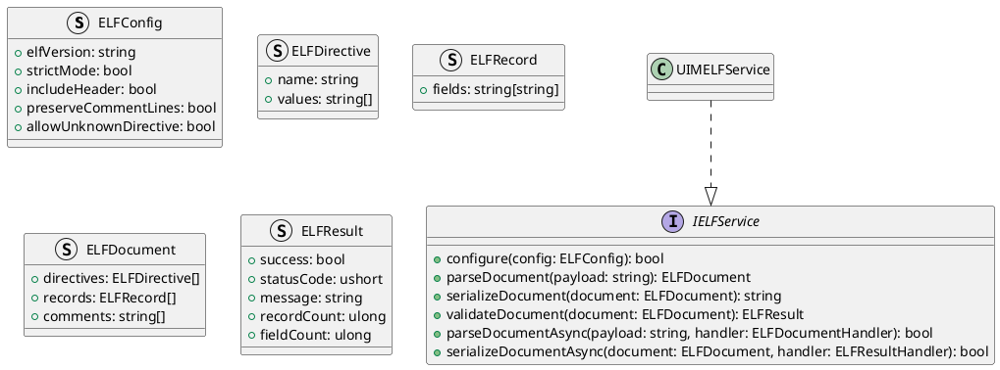
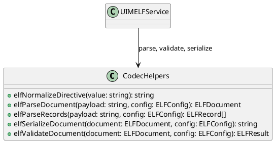
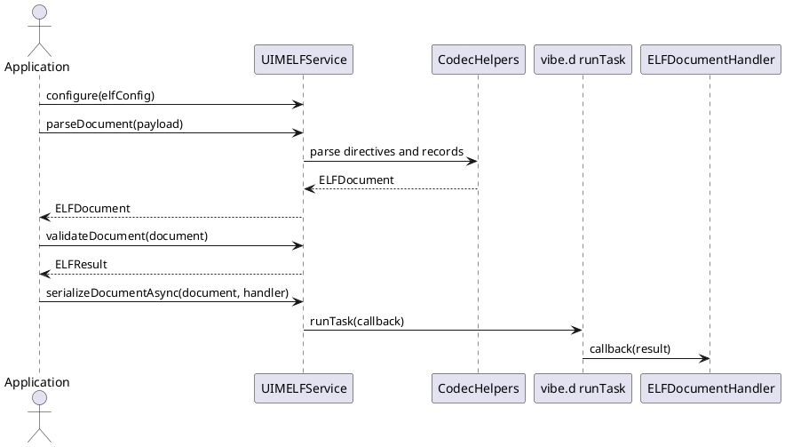

# UIM-ELF UML Description

## Overview

The UIM-ELF library provides a compact architecture for Extended Log Format workflows in D. It combines typed contracts, directive/record parser helpers, result model constructors, and asynchronous orchestration with vibe.d.

## Core Types

## Helper Layer

## Sequence

