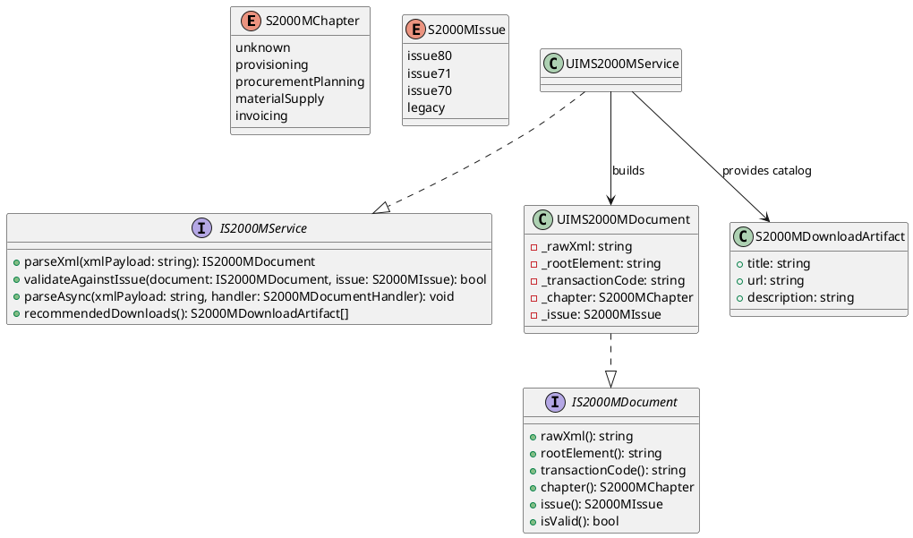
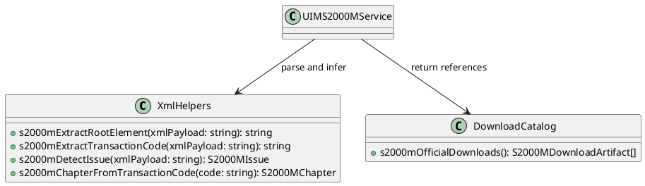
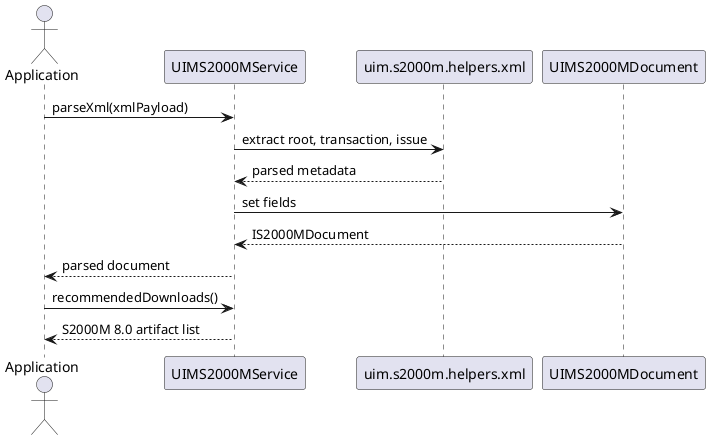

/****************************************************************************************************************
* Copyright: © 2018-2026 Ozan Nurettin Süel (aka UI-Manufaktur UG *R.I.P*)
* License: Subject to the terms of the Apache 2.0 license, as written in the included LICENSE.txt file.
* Authors: Ozan Nurettin Süel (aka UI-Manufaktur UG *R.I.P*)
*****************************************************************************************************************/

# UIM-S2000M UML Description

## Overview

The UIM-S2000M library models S2000M exchange payload metadata and provides service-oriented parsing helpers for D projects using vibe.d runtime patterns.

The architecture aligns with official S2000M download artifacts by exposing Issue 8.0 metadata and associated model/schema artifact links (PDF, XSD, EAP, XMI).

## Core Types

## Helper Layer

## Sequence

