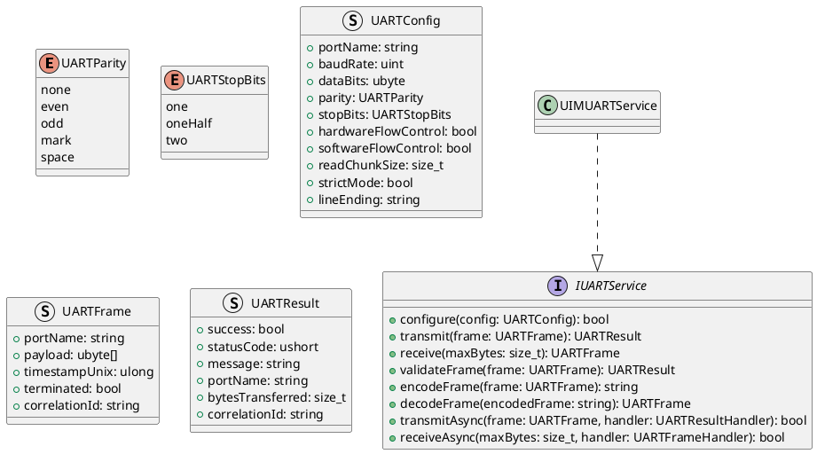
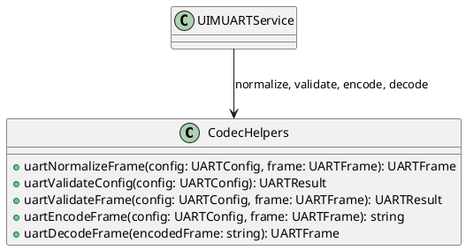
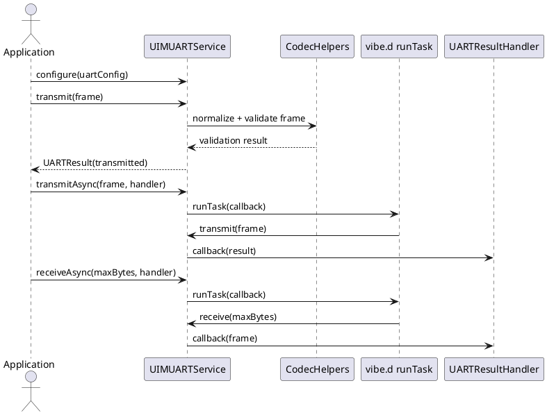

# UIM-UART UML Description

## Overview

The UIM-UART library provides a compact architecture for UART communication workflows in D. It combines typed serial configuration, byte-oriented frame models, validation helpers, deterministic codecs, and vibe.d-based asynchronous orchestration.

## Core Types

## Helper Layer

## Sequence

