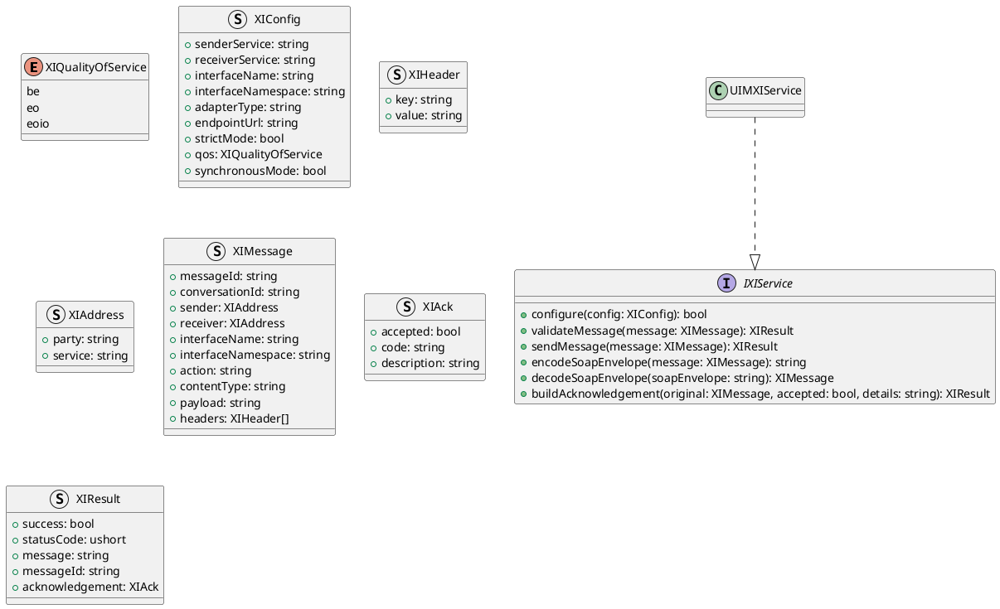
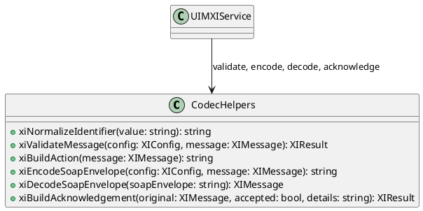
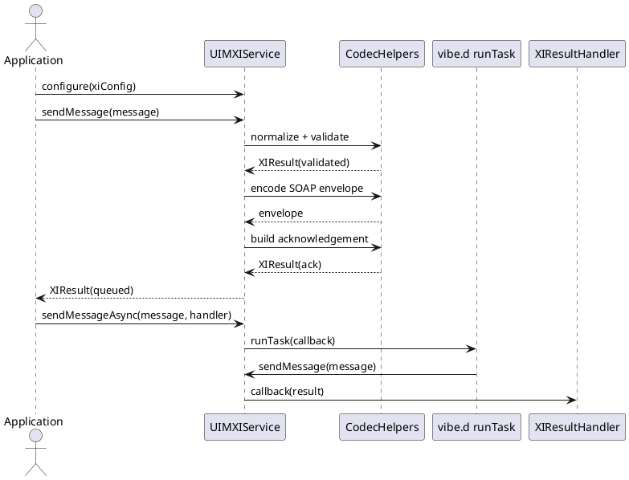

# UIM-XI UML Description

## Overview

The UIM-XI library provides a compact architecture for SAP XI message protocol workflows in D. It combines typed contracts, SOAP codec helpers, acknowledgement helpers, and asynchronous orchestration with vibe.d.

## Core Types

## Helper Layer

## Sequence

