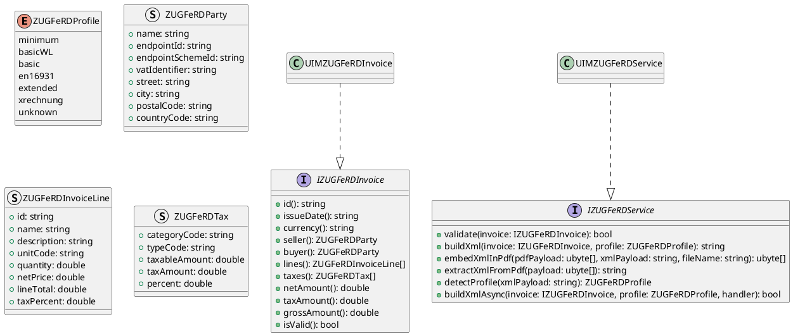
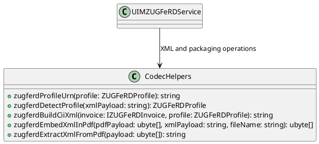
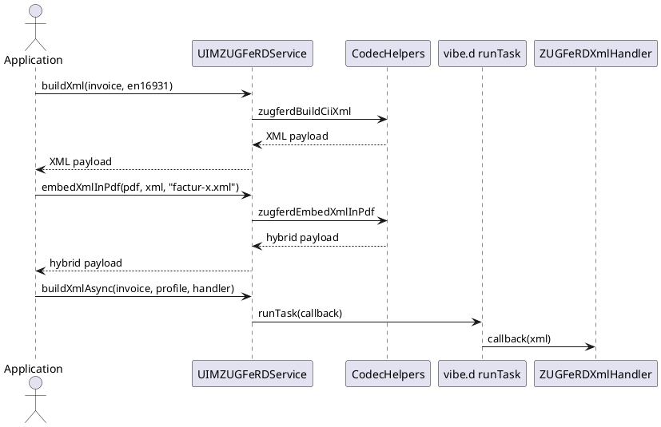

# UIM-ZUGFERD UML Description

## Overview

The UIM-ZUGFERD library provides a compact architecture to model invoice data, build Factur-X/ZUGFeRD XML, and package XML with PDF payloads for hybrid invoice exchange.

## Core Types

## Helper Layer

## Sequence

